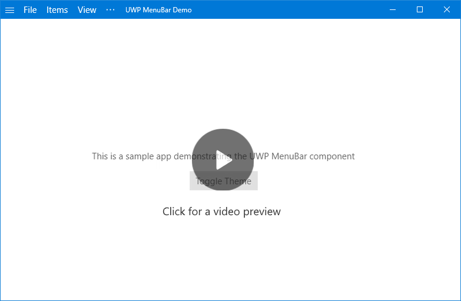

UWP Menu Bar Control
====================
[](https://www.nuget.org/packages/Rymate.Controls.UWPMenuBar/)

[](https://rymate.co.uk/videos/video.php?id=a470130d39)

This project aims to reimplement the classic menu bar component as a 
UWP library.

To install, use the following command in the Package Manager Console

`Install-Package Rymate.Controls.UWPMenuBar -Pre`

Currently the library has the following features:

## Menu Bar

The main component is the Menu Bar, which defines a container which can 
hold Menu Bar buttons, and an optional area which can be used as a drag
area for a title bar. It also holds the hover behaviour for opening menu 
bar items on hover when another one is opened.

```xaml
<lib:MenuBar Grid.Row="0" Title="UWP MenuBar Demo" x:Name="MenuBar"
             VerticalAlignment="Top" Background="{x:Bind ViewModel.AccentColor}"
             Foreground="White" >
			 
             <!-- items here -->
			 
</lib:MenuBar>
```				

### Using as a title bar

Once you've extended the window view into the title bar, you can turn
the menu bar into the draggable area using thre DragArea property

```C#
Window.Current.SetTitleBar(MenuBar.DragArea);
``` 

This ensures you can still use the buttons in the menu bar.

## Menu Bar Buttons

These can either have a dropdown (like a menu bar) or are standalone
buttons, which can be used for revealing a SplitView. They're also 
AccessKey aware, meaning users can activate them via `alt + access key`.

Additionally, they can either display a label or an icon from the built
in Segoe MDL2 icon font.

```xaml
<lib:MenuBarButton ButtonContent="View" AccessKey="v">
    <!--items here-->
</lib:MenuBarButton>

<lib:MenuBarButton DisableDropdown="True" ButtonContent="&#xE700;"
                   Icon="True" AccessKey="s" />

```

## Menu Bar Item / Menu Bar Toggle Item

These are essentially very small wrappers that wrap the equivalent
`MenuFlyoutItem` in order to reduce the default padding on them.

The padding can be increased / decreased via the normal methods
still.
